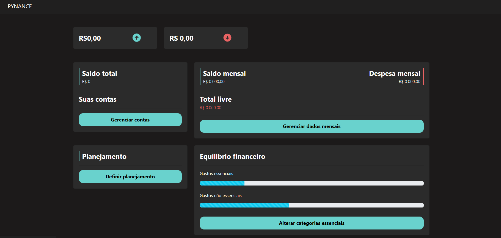

# PYNANCE
# Um aplicativo de gestão pessoal financeira
Aplicação web desenvolvida em Python que permite ao usuário controlar suas finanças pessoais.
Funcionalidades:
- Criar, editar e excluir contas bancárias, categorias de despesas e receitas, entradas e saídas de dinheiro e planos financeiros.
- Visualizar o saldo atual de cada conta, o histórico de movimentações e o fluxo de caixa mensal.
- Gerar relatórios personalizados por período, conta, categoria ou plano.
- Acessar um dashboard com indicadores que mostram a sua situação financeira geral.

